# Sound and Weather Data Monitoring within a Smart Stadium
## Executive Summary

Boasting a capacity for 82,300 people, Croke Park stadium is one of the largest stadiums in Europe. It’s home to the Gaelic games, headquarters the Gaelic Athletic Association (GAA), and hosts numerous high-profile international sporting, cultural, and music events. And now, within this urban test bed infrastructure lies the perfect Internet of Things (IoT) microcosm: a true “smart stadium.” The Croke Park Smart Stadium project is a collaboration between GAA, Dublin City University (DCU), Intel, and Microsoft to further the innovation around IOT. Intel has strategically positioned sensors and gateways throughout the stadium. These gateways compute and communicate with the sensors, collecting enormous amounts of diverse types of data and storing them on the Microsoft Azure cloud platform. Researchers at DCU are using the Azure IoT Suite to analyze that data and then create dashboards that provide stadium management with real, actionable insights. These insights have enabled them to improve fan experiences, foster better relations with the local community, reduce their carbon footprint, and ensure a safe experience on some of their tourist attractions while driving efficiencies and cost-effective stadium management.

Laura Clifford, Commercial Development and Engagement, Research & Enterprise Hub, Dublin City University, led the effort to help interested companies learn about and participate in the project. “We’ve had more than 30 companies actively involved with us in understanding how they could potentially deploy their pre-commercial IoT technologies here at Croke Park,” she said.

Authors:

Niall Moran, Principal Technical Evangelist, Microsoft Ireland

David Prendergast, Intel

Suzanne Little, Dublin City University

## Business Case

One objective of the Croke park project was to learn about how IoT technology can be deployed but another was to realise how this technology could be deployed to solve real business challenges. With this goal in mind, the research team worked closely with the GAA to align the technology solution with use cases that could offer business value to the organisation:

### Sound Pollution

An important step in building strong community relations is ensuring that Croke Park is a good neighbour in that its events must have a minimal impact on those who live nearby. That starts with environmental sound monitoring. When it comes to decibels, Croke Park must stay within the parameters established by Dublin City Council. Before the Smart Stadium initiative, an independent third party would record the noise levels and let the Stadium know after the fact whether it was in compliance. Now this monitoring is done in real time.

An automated solution to this problem solves a number of problems for the GAA:

1.  Reduced overhead in sound monitoring: The current solution is very manual and requires significant effort throughout a concert to record results.

2.  Sound data can be disseminated through multiple channels, e.g. a website, an publicly accessible app or a dashboard accessible by key personnel.

### Fan Engagement

The ability to monitor sound plays a part in enhancing the fan experience, as well. The system that allows the park to measure the noise levels inside the stadium for compliance is the same one they use for friendly fan competition within the stadium bowl. As they monitor crowd cheering levels, the information is presented on a dashboard to the staff, who in turn project it on a stadium screen enabling them to “gamify” the data and identify which section is making the most noise. A great example of this is the data that was presented during the 2016 All-Ireland final which compared the noise levels at particular points in the game: key scores.

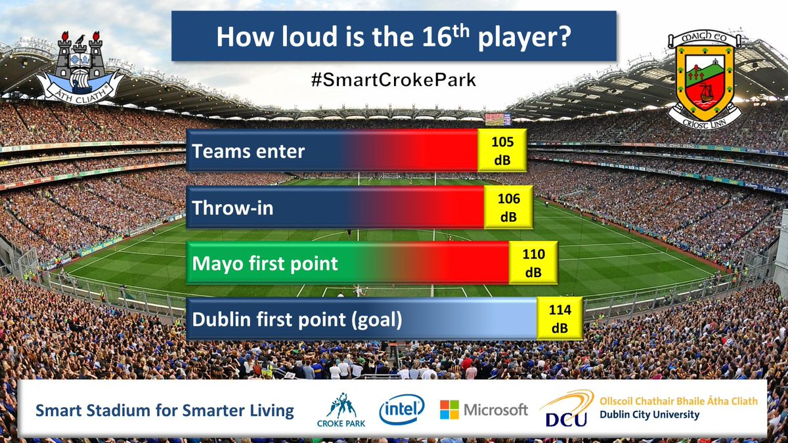

### Health and Safety

The Etihad Skyline tour at Croke Park offers visitors unmatched panoramic city views and insights into Dublin’s celebrated landmarks. While a stroll around the top of one

of Europe’s largest stadiums can be thrilling, a 17-story high walking tour can also be a real safety concern. The team has deployed wind speed sensors that collect the data in real time and feed the information back to the tour organizers so they know whether it’s safe to proceed. This seemingly simple implementation has far-reaching implications for the project team.

## Solution

As well as the business requirements noted above there are a number of other functional requirements that needed to be considered:

1.  For sound monitoring it is important to strategically position microphones within the stadium. To understand noise levels for both crowd cheer and pollution level microphones must be located both within the stadium bowl and externally. For this reason 4 microphones were deployed, 2 on the East side of the stadium and two on the west side. Each side had one microphone inside the stadium and one outside.

2.  Keeping in mind that the stadium represents a microcosm of a city, an important requirement for the project was that the team learn how best to deploy an IoT solution and use these learnings to help other companies build their own smart city solutions. This means carefully architecting solutions so that they can scale when applied to the real world.

### Engagement Approach and Team 

One of the challenges in working on the smart stadium project was the various skills sets required, including:

1.  Sound and weather monitoring specialists. This activity was primarily carried out by Croke park staff and Sonitus a specialist sound monitoring organisation.

2.  Gateway management, including: deployment, networking and development. Intel deployed and managed all gateways within the stadium with GAA IT staff providing connectivity to the network and internet, where required.

3.  Stadium staff for access control and health and safety monitoring.

4.  Cloud specialists to handle the ingestion and analysis of collected data. Cloud capabilities were provided by Microsoft.

5.  Business intelligence and UX experts to develop dashboards and user interfaces for displaying the data in effective ways. All BI dashboarding was provided by Microsoft.

6.  Data scientists to analyse data and develop predictive models to proactively act on intelligence extracted from historical data. All data science work was carried out by a team of research scientists at Dublin City University (DCU).

Bringing all of these resources together and successfully managing the delivery of each use case was challenging and required a governance model managed by two core teams:

1.  A central governance team responsible for agreeing use cases and alignment between all parties. This team managed the budget for all delivery and provided the direction for prioritising the delivery of specific use cases.

2.  A core technical team responsible for designing and implementing solutions for each use case.

### Technical Solution

The technical solution was designed based on the above business, functional and non-functional requirements. The following table details the components along with the partner responsible for the deployment and operation and notes on how these components satisfied requirements:

| Component                  | Provider        | Details/Links                                                                    | Notes                                                                                                                                                                                                                                                                                                                                                                                 |
|----------------------------|-----------------|----------------------------------------------------------------------------------|---------------------------------------------------------------------------------------------------------------------------------------------------------------------------------------------------------------------------------------------------------------------------------------------------------------------------------------------------------------------------------------|
| Sound monitoring equipment | Sonitus Systems | [*EM2010 sound level monitor*](http://www.sonitussystems.com/products/EM2010)    | 4 sound monitoring microphones positioned around the stadium, 2 internal and 2 external as per stadium map.                                                                                                                                                                                                                                                                           |
| Gateway Devices            | Intel Labs      |                                                                                  | 4 gateways positioned strategically around the stadium. The key criteria for determining location was based on the networking access. \[DP: need some detail on networking here\]. Communication using RFB radio                                                                                                                                                                      |
| Master Gateway             | DCU             | Central Ubuntu machine \[DP: can you get details on version etc\]                | This machine aggregates and collates all data from the gateways to be pushed to the cloud. This removes the need to have internet connectivity for each gateway and gives us a certain amount of resilience as data can be collected and stored                                                                                                                                       |
| Azure Cloud                | Microsoft       | [*Microsoft Azure IoT Services*](https://azure.microsoft.com/en-us/develop/iot/) | The Azure cloud is used to provide all back end and business intelligence functions including, device registration, security, data ingestion, real time analytics, storage and display.                                                                                                                                                                                               |
| Cognitive Models           | DCU             |                                                                                  | DCU work with all of the data collected to analyse quality and help direct the overall architecture including position of microphones as well as how to deal with interference. DCU are also working on developing machine learning models that can be used to predict outcomes based on data feeds. For example, the likelihood of the Skyline tour being cancelled at certain times |

 
### Architecture

The fundamental premise of the technical solution was to design with the following architectural concepts in mind:

-   Loosely coupled components. This meant that each component used was not dependant on any other component or could easily be replaced, updated or removed without affecting the entire solution. The benefit of this approach was that the we could test individual components and replace or update independently when required.

-   Queue centric approach. Following on from the loosely coupled approach the project team wanted to build as much resilience into the solution as possible. For example, one of the challenges within the project was positioning of microphones in relation to the radio antenna used to provide connectivity for the microphone gateways back to the master gateway which communicated with the cloud. Messages sent to the master gateway were then queued and sent to the cloud using the IoT Hub. This meant if connectivity from the gateway to the cloud was an issue that data was still being collected and could be sent later. This same principle was adopted in the cloud where different services performed separate functions and communicated with each other via queues.

-   Separation of Concerns: As well as loosely coupling components and queuing communications between them each component was designed to provide a certain function and nothing else. This again supports the maintainability and extensibility of the solution by allowing each component to be updated without affecting the entire solution. This proved critical in this IoT project as there are so many components doing different things. The best example of this is separating ingestion from real time communications via the IoT Hub and Stream Analytics respectively. When we wanted to update or amend a new real time query to the data we could stop the stream analytics job without affecting the ingestion and update the queries before restarting the service. This is fundamental to creating a solution that could scale to a globally deployed IoT scenario.

### Components

The complete solution is made up of a number of components, both within the stadium and in the cloud. The following section details these components and explains how they interact with the architectural principles above in mind.

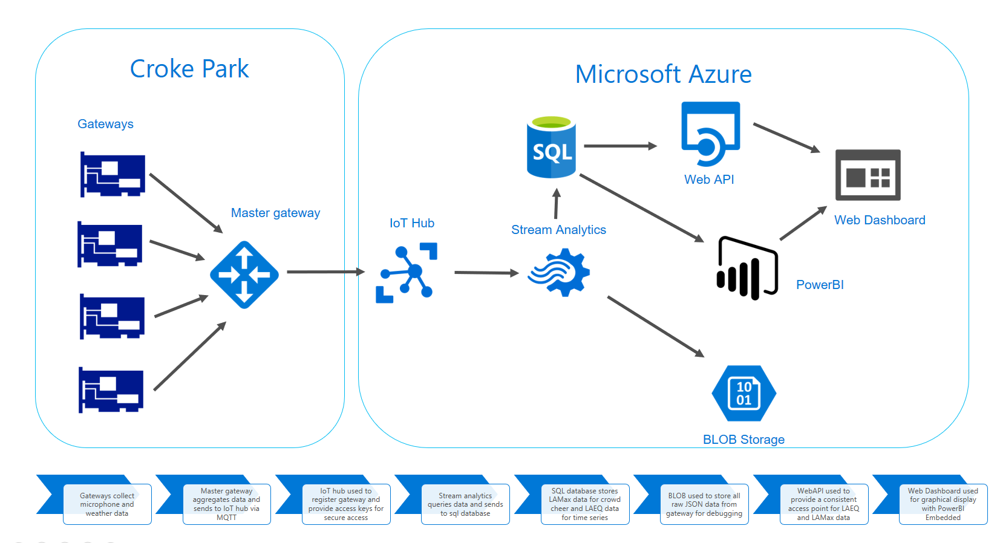

### Sensors and Gateway Equipment

In order to capture noise levels throughout the stadium, sound monitoring equipment was positioned at four points. Two within the stadium at the stands and two outside the stadium. This allowed us to measure crowd cheer within the stadium but also compare this to external sound to monitor sound pollution for neighbouring areas. The photo below shows the position of one of the Sonitus microphones.

A weather station was also deployed to measure wind speed and other data and was positioned at the top of the stadium between the Cusack and Davin stands. The below diagram shows a schematic of all of the different sensor equipment deployed as well as the gateways.

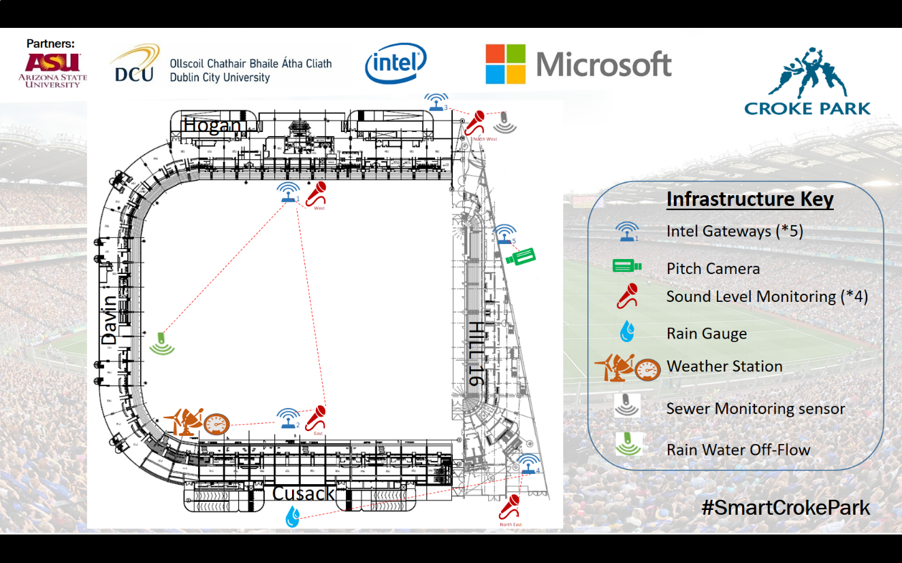

The job of the gateways are to collect the relevant sensor data and communicate the data back to a central store. To connect to the gateways each piece of monitoring equipment is connected to a [*Seedstudio RFBee v1.1*](http://wiki.seeed.cc/RFbee_V1.1-Wireless_Arduino_compatible_node/) using simplex communication. Each unit is setup in Transceive mode (Send and receive), Baud rate 9600 8N1 and no flow control. These units are attached via USB connection and use a [*UartSBee*](https://www.seeedstudio.com/uartsbee-v4-p-688.html) adapter. The Data is transferred in wireless serial mode using UART between the RFBee unit and the Gateway.

The gateways used are [*E100-8Q from SuperMicro*](https://www.supermicro.nl/products/system/Compact/IoT/SYS-E100-8Q.cfm) based on the [*Intel Quark Processor*](http://ark.intel.com/products/79084/Intel-Quark-SoC-X1000-16K-Cache-400-MHz) and are powered by Wind River Linux 5.0.1.

For the initial work done each gateway then send data to a master gateway which in turn send data to the Azure cloud, specifically an IoT Hub. This allows us to aggregate and cache data centrally within the stadium for edge analytics. Once the master gateway receives the data it then connects to the IoT hub and transmits the data. The master gateway is based on Dell PC running Ubuntu 14.4 LTS.

### IoT Hub

The Azure IoT hub is a cloud service responsible for device registration, securing the data transfer and high volume data ingestion. In this case the master gateway is the only device registered with the hub and a unique device id is passed in all payloads so we can establish which gateway the data originated from. This means that the IoT hub is sent all data collected, including weather and sound data. The data format must be JSON and is shown below. To connect with the IoT Hub the master gateway can send data over MQTT, IMQP or HTTP and must use an encrypted tunnel. There are a number of [*SDKs available*](https://azure.microsoft.com/en-in/develop/iot/get-started/) but in our case LUA scripts were used to connect directly with the REST API and sent the data over HTTPS. The below diagram shows a snippet of this LUA script as well as the JSON structure for the pay load.

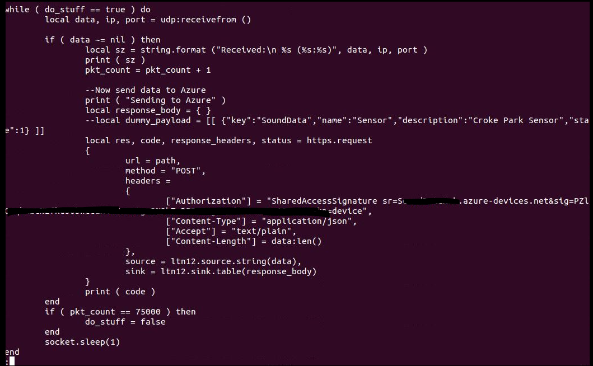

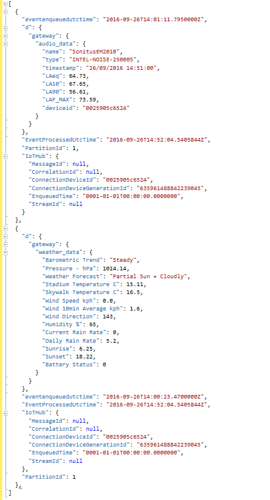

### Stream Analytics

Once data has been ingested into the IoT Hub, Stream Analytics is used to analyse the data and create a stream of data for each use case. Each stream of data is then outputted to a table in the SQL database. There are two stream analytics jobs, one to handle weather data and another to handle sound. Each job has the IoT Hub as input and defines a number of outputs. The table below outlines each stream analytics query, their inputs, queries and outputs:
 

| Stream Analytics Job            | Input  | Outputs    | Queries                                                    | Description                                                                                                                                                     |
|---------------------------------|--------|------------|------------------------------------------------------------|-----------------------------------------------------------------------------------------------------------------------------------------------------------------|
| CrokeParkStreamAnalytics        | IoTHub | sql        | 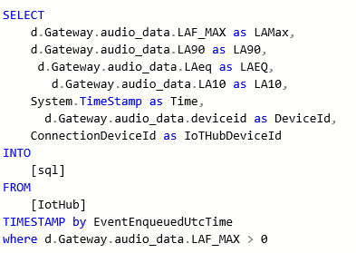               | Sends all sound data points to a sql database table. The LAMax values are used to evaluate intensity of crowd cheer.                                            |
|                                 | IoTHub | sqlrolling | 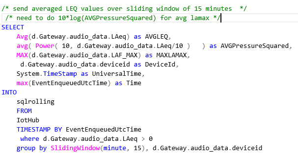               | Retrieve a rolling average of LAEQ values to determine a normalised view of sound data for noise pollution. The average is calculated as a logarithmic average. |
|                                 | IoTHub | soundblob  | 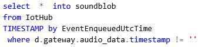               | All data points are sent to blob storage for diagnosis.                                                                                                         |
| CrokeParkWeatherStreamAnalytics | IoTHub | Sql        | 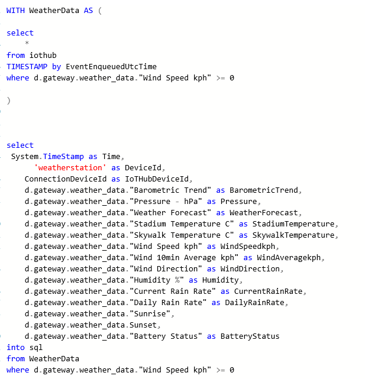              | Raw weather data is sent to a sql table                                                                                                                         |

 

 

### SQL Database

An Azure sql database is used to store relevant data for analysis or display. The SQL Database is a fully managed relational database service hosted on Azure and offers 99.99% SLA for availability which helps this solution scale to a fully production system. The database also supports 100 database transaction units but can scale to 4000 units when required. The DTU is a blended measure of performance that can be used to get predictable performance.

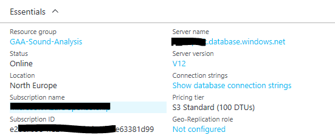

The database tables are populated by the stream analytics jobs described above.

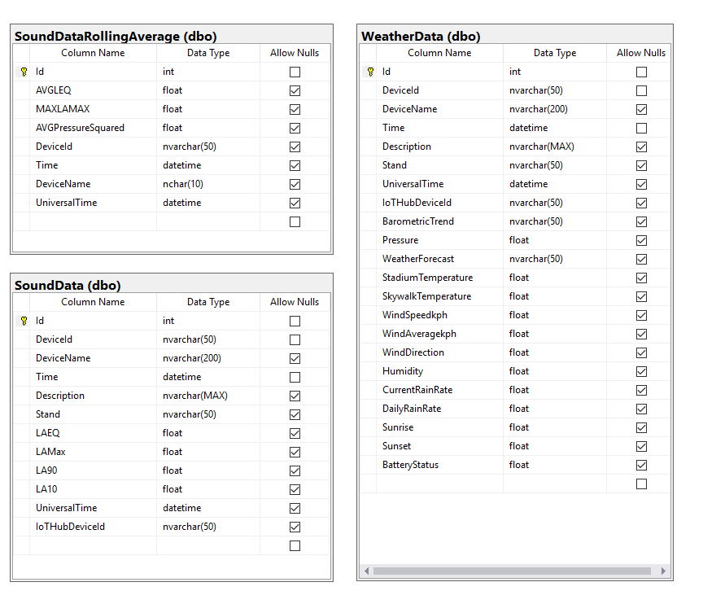

### BLOB Storage

As well as storing the data in a structured store like SQL Database we have also used BLOB (binary large object) storage to store all raw JSON data that is sent to the IoT hub. This has allowed the team to query the JSON directly and review the format as well as diagnose any issues with data ingestion. This also allows us to take sample data and use to test with stream analytics jobs' queries.

The image below shows how the storage account can be monitored including data inserts over time and egress of data. For the purposes of this pilot a geo-replication storage account was used. This meant that all data was replicated 3 times within the Dublin Azure region but also replicated out to the Netherlands region in case of a disaster. This is important as this forms the basis of our disaster recovery plan. If something happens in Dublin we can rebuild the entire system using the data stored in this BLOB account. Even if Dublin were completely down due to some natural disaster all data could be retrieved from the Netherlands.

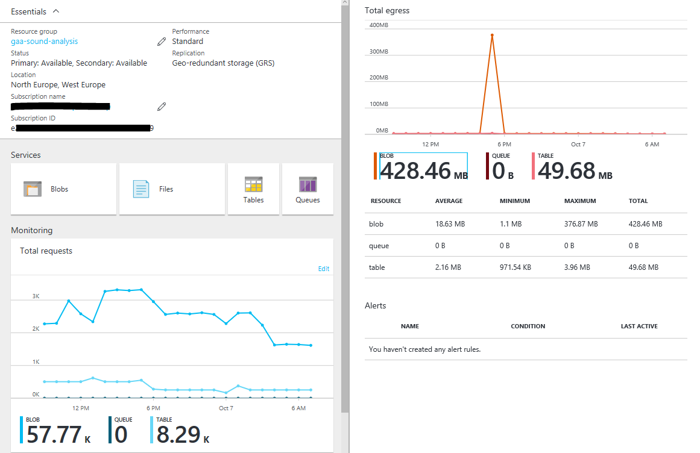

### Web API

The Web API application was created in Visual Studio 2015 and contains a number of REST APIs to access the data stored within the SQL Database. This REST api is then used by front end dashboards or apps that need access to any of the data.

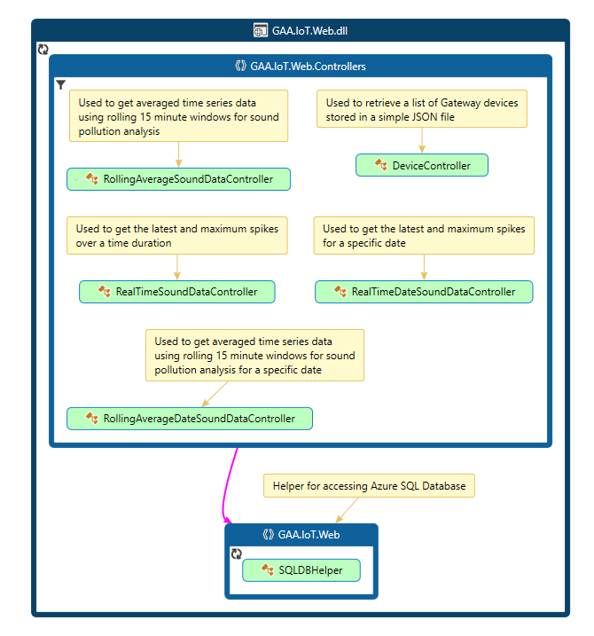

### Web Dashboard

A simple web dashboard was created to present the data online. The dashboard was built using the MVC framework within Visual Studio 2016 and used Power BI embedded to embed Power BI dashboards. The Power BI dashboards were built using Power BI Desktop and then uploaded to Microsoft Azure to make them available to the web dashboard. To get started building the dashboard [*sample code*](https://github.com/Azure-Samples/power-bi-embedded-integrate-report-into-web-app/) from the Azure team was used.

Two Power BI reports were created and uploaded to an Azure Power BI Workspace. Both reports connect directly to the Azure SQL Database described earlier and use a number of views to present the following information:

-   15 minute rolling average sound data and maximum spikes for the last 20 minutes, 60 minutes, 2 hours, 1 day and any specific date to review historical data. This data is represented in a single Power BI data set as tabs, see diagram below.

-   Most recent wind speed data, average wind speed data for the current day and a time series graph of wind speed for the current day. This graph helps indicate the likelihood of a sky line tour taking place.

Diagrams below show the dashboard interfaces:

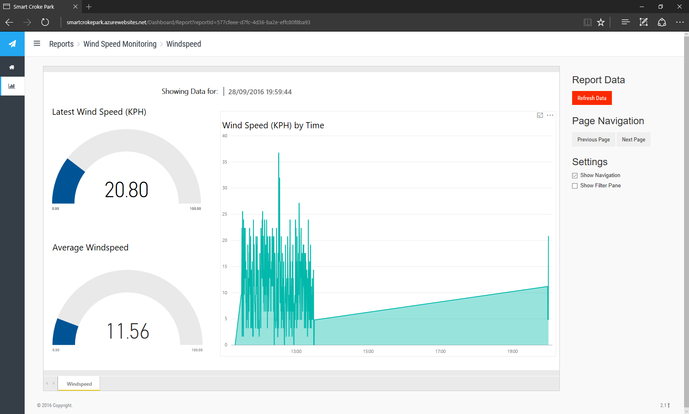

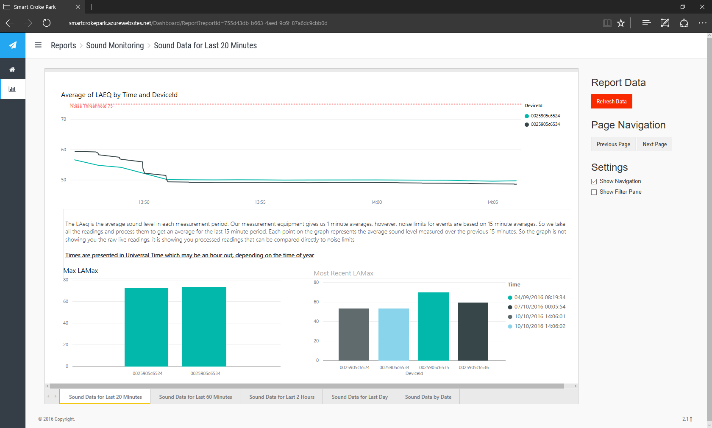

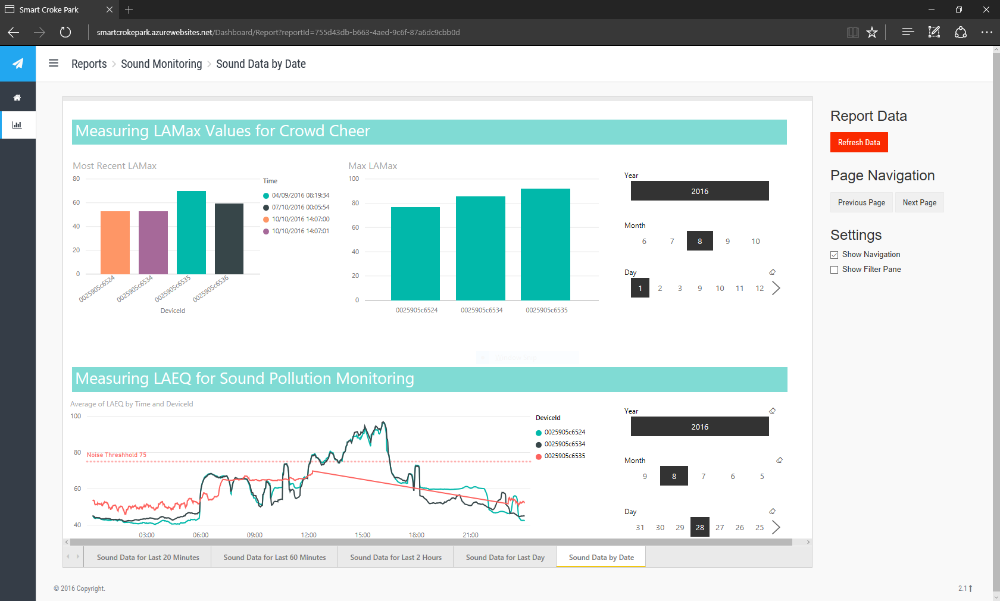

## Conclusions

The purpose of this project was primarily research and some decisions made were done so in this light. For example, choice of radio and gateway devices would be different when this project is rolled out for full production. This said, conducting this research project with a clear view of the business models and use cases from the outset has enabled all stakeholders to learn exactly what is involved in developing and deploying an IoT solution that can drive business value. To do this, the project team had to ensure that certain elements of the infrastructure and the outputs of the solution were robust enough to allow us to demonstrate real business value with a clear view of total cost of ownership and return on investment. To achieve this we did a number of things:

-   From the outset we engaged with Sonitus who are an industrial sound monitoring organisation commissioned by the GAA to monitor sound pollution during concerts. This proved invaluable in designing the dashboard interfaces and allowed us to prove that collecting the data centrally and sharing this data via the dashboard could greatly improve the productivity of the sound monitoring exercise and at the same time provide a mechanism to prove compliance with sound pollution regulations.

-   Once the solution was ready we engaged with the GAA communications team to implement a fan engagement scenario, the crowd cheer, during the All-Ireland inter county football and hurling finals. This simple scenario saw the GAA get 25,000 impressions on one single tweet sent during the final. This engagement far exceeds anything that was done before and offers real value for the GAA in engaging with their members and fans.

-   The use of Microsoft Azure and Power BI as the back end ingestion and analytics platform allowed the team to deploy a solution quickly as the IoT and Dashboarding services available are pre-built for these type of scenarios. This resulted in a lot less coding and development work than would have been required if the solution was built from the ground up. Using Azure also meant we were using a robust platform that could handle the relatively low amounts of data we were processing for this pilot but could scale to handle a significantly larger deployment and keep the costs in line with this scale. This has allowed the team more accurately predict the cost of the solution as it grew.

### Learnings

-   **Team makeup and governance**. As this IoT project has proved there are quite a few elements that need to work together, from sensors to gateways to data collection and analysis. This means working with a variety of different technologies that require different skills and resources to get working well. It also requires working with a number of partners and/or vendors to realise the value of the project. Creating a good governance framework and rhythm of business from the outset was critical for the success of the project. This involved a bi weekly steering group meeting to agree strategy and report on progress with representatives from all partners as well as a technical core team that discussed implementation details and reported back up to the steering committee.  

-   **Health and Safety**: Due to the nature of an IoT project equipment must be installed and/or configured on site. For this project we were challenged with connectivity between microphones and gateways and had to move gateways to find the optimum positioning to ensure connectivity. Doing any of this work requires physical access to stadium stands and requires personnel on site to support. These activities can take time and need to be accounted for in project plans.

-   **Resilience**: As this was a proof of concept some of the equipment used and how it was connected was not robust enough if this solution was to be used in a production environment. RFB radio connectivity, for example, is not robust enough and meant we spent a lot of time positioning gateways and microphones for optimal connectivity.

-   **Packet loss:** With so many inter connected parts we found that we lost packets of data quite often and it was difficult initially to understand where we were losing them. After investigation, we discovered a number of issues:

    -   The reliability and resilience of the gateway solutions was not good enough for a production system. Sometimes the microphones were losing connectivity with the gateways and sometimes the master gateway was losing connectivity with Azure. This problem is well recognised and a project underway to build more resilience into the solution.

    -   JSON format. The Azure backend setup relies on data being sent in JSON format and because this data was being analysed and aggregated in real time the data was expected in a specific format. Any invalid JSON or changes to the format resulted in dropped packets by Azure. New functionality in Stream Analytics makes it very easy to test real time analytics scripts against sample data, but there seems to be no real way of dealing with invalid formats. To resolve this all data was pushed to BLOB storage so that we could analyse all packets to understand where formats were changing. This helped greatly in agreeing a strict format and sticking with it as well as making the stream analytics jobs flexible enough to handle new data sent within the packets. Invalid JSON was much more difficult to deal with and was simply dropped. It is worth considering using routines on the gateways or master gateway to validate JSON formats before sending to Azure and alerting or logging results.

-   **Payload Frequency:** The edge microphones aggregated data and sent pay loads to the gateways every minute. This frequency was perfectly fine for the sound pollution use case when data is aggregated over 15 minute periods, however, this could mean missing a spike at a match. As this solution proved very succesful for fan engagement the team will be investigating opportunities to increase the data frequency.
