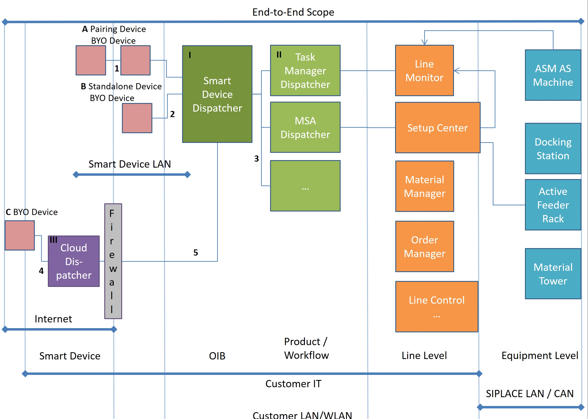
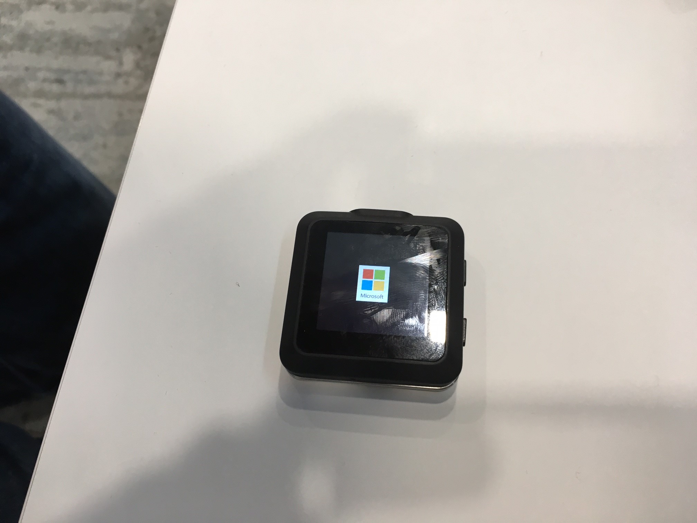
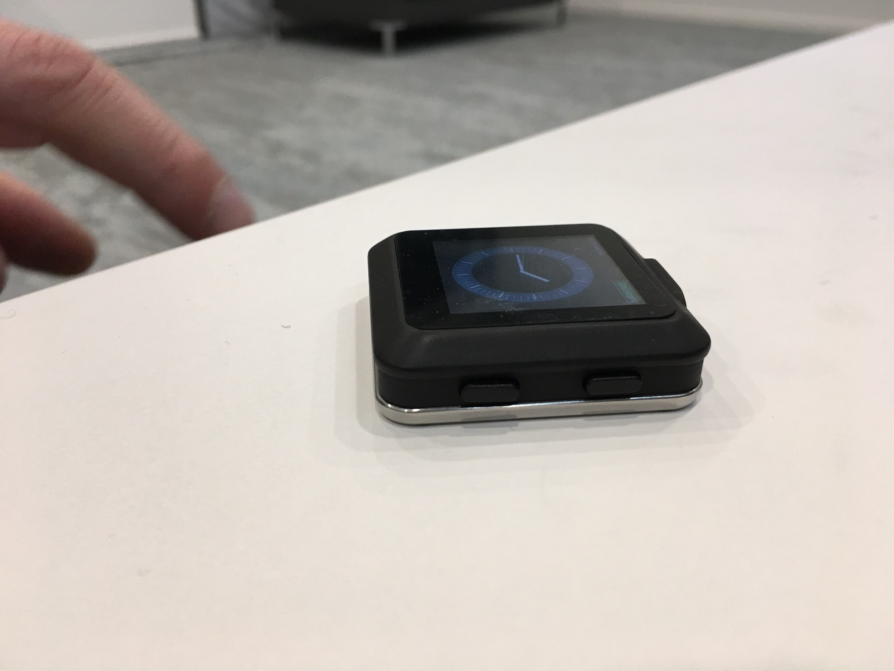
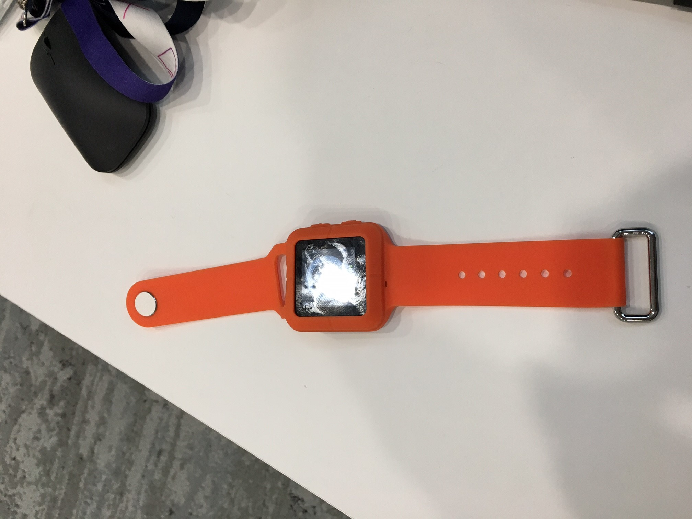
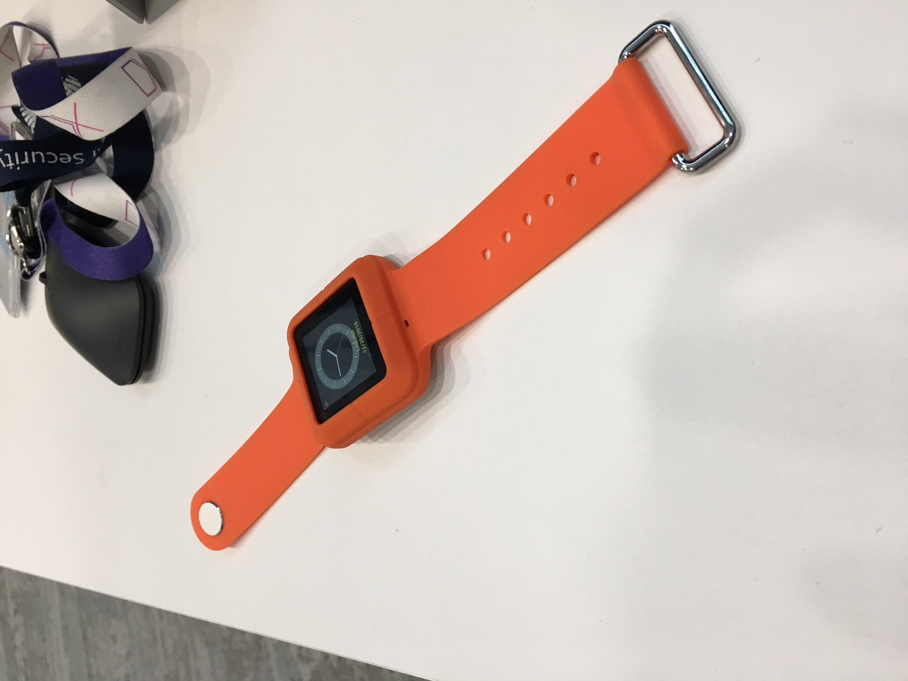

## The way to ASM

Due to the high competition in the PCB manufacturing market, ASM needs to lead with innovative solutions aiming to be 
the first industrial provider of Industry 4.0 solutions.

The customer has to improve the efficiency of assembly lines by reducing machine maintenance and outage time. 
The R&D department had already spent some time attempting to solve this scenario and had built 
a showcase for an industrial fair, displaying and processing alarm messages and material management 
on a smartwatch based on Android Wear in conjunction with an Android based mobile phone.

First Contact with ASM happend after the fair-show and the first version of the showcase 
and Marco Richardson (Technical Evangelist) was asked to make a pitch for the Microsoft Band2.

The apparent EOL of Micrsoft Band and revisiting the scenario in more detail together with Juergen Schwertl (Technical Evangelist, App Development and IoT) 
it became obvious that the Operator app itself would be only a small scenario within
a much bigger opportunity for an IoT solution leading ASM into the world of Industry 4.0 and preparing
the platform to in future also allow for Machine Learning and Predictive Maintenance.

## Customer profile ##

[ASM](http://www.siplace.com/de/Home) is a global provider based in Munich offering complete electronics production chain solutions ranging from wafers to chip and module production to SMT placement process. 
Industry: Discrete Manufacturing, Vertical: High Tech and Electronics

### The Project - Team 

Product Owner	Cord Burmeister (ASM)
Scrum Master	Thomas Priegl (ASM)

Development	    

- Joachim Broeckl (ASM)
- Michael Koenig (ASM)
- Guenter Rall (ASM)
- Alexander Ostrovsky (MK) (ASM)
- Rupert Schauer (in-tech) (ASM)

Architecture	

- Axel Schroeppel (ASM)
- Marco Richardson (Microsoft)
- Juergen Schwertl (Microsoft)
- Julia Jauss (Microsoft)

### Problem statement

At this point, ASM was looking for alternatives to the Android smartwatch they were using in the showcase 
described above, which should have more industry-oriented features like water and acid resistence. 
In addition, the model used in the showcase did not have any user management or device management capabilities 
through existing management systems. But also the Microsoft Band2 is not capable for the use at 
a production site and there are currently no suitable devices in the existing market.
 Through contacts with one of our ODMs, which were working on an industry smartwatch based on 
Windows 10 IoT Core, we were able to win the trust of ASM.

ASM got convinced that a transformation from the existing on-premises environment into an IoT based hybrid cloud 
environment is a necessary and reasonable step especially since it would be a door opener for much broader IoT 
solutions including predictive maintenance scenarios. 

### Proposed solution
The aim of the proposed solution is to ensure efficient assembly structures by reducing the amount 
of machine down time. Adding and removing supplies such as tapes with electronic components, maintenance 
and outages might cause the stop of machines. 
Within this IoT & wearable scenario, Microsoft technologies will enable the assembly line operators 
to be immedeatly informed about changes in the machine status via their wearables. 
This will streamline the manufacturing process to achieve a more efficient machine utilization by reducing 
e.g. walking distances for supply restocking. 
End-to-end messages of the PCB assembly machines will be transferred via IoT Hub to the wearable 
of the factory worker closest to the machine.

### Goal Definition

-	Support Windows 10 IoT Core as client/wearable device 
-	Manage the integration of Smart Devices into the existing IT infrastructure:
    + Position of the devices
    + Guarantuee constant actuality of the device‘s software
    + Ensure secure communication between wearable devices, assembly systems and backend infrastructure.
    + Applicability in industrial environments
-	Integration of ASM AS SW portfolio with SmartDevices on-premises and via cloud
-	Enhance ASM AS product portfolio with Smart Device support
-	Develop a reference implementation for the use of Microsoft technologies in an industrial production environment

Further: use the hybrid infrastructure to collect, analyse und store the log data of their machines for predictive maintenance and remote services. 

### Key Technologies

- Device: ARM based smartwatch with Windows 10 IoT Core
- Ingestion: IoT Hub
- Compute: Azure Stream Analytics
- Storage: Azure SQL, Azure Storage
- DevOps: Visual Studio Team Services
- Coding-Lang: C# (Xamarin for extended scenario for line manager mobile dashboard app)
- App Plattform: UWP

In a first kick-off meeting the agenda was focused on the outlined conceptions of ASM as well as the 
architecture of the existing software components of the solutions in use.

### Implementation 

Juergen Schwertl and Marco Richardson provided a smaple implementation of the following components 
with a [reference implementation](https://github.com/MicrosoftDXGermany/SmartDeviceIoT) during the 
implementation phase to ASM:

-  UWP Smartwatch Client, which is able to run on a Windows IoT core instance. 
   It can receive and approve messages from Azure IoT Hub. 
   The app has a message listener, who can receive the messages directly with low latency.

- UWP app "ServerView" for early testing and learning purposes, which retrieves the current status of the devices that have been made known 
  to the IoT hub (with provisioning information like DeviceID and online / offline state visualisation). 
  It is also possible in the ServerView to send messages directly to any of the known devices.

- UWP App "Machine Simulator" which is able to send faked alarm messages to the IoT Hub with the DeviceID 
  of the target wearable on the shop floor. The Machine Simulator uses the Azure API App as the interface 
  in the web, which will also use the existing onPrem backend of the ASM machine solutions in the 
  industry environment. The simulator send data in the same data structure, that should come from the 
  prod systems as well.

- Azure API App wich is the interface between the Azure IoT Hub and the onPrem systems of the existing 
  ASM solutions on the factory floor. ASM has a task to implement the security and user management 
  on their side of the project team. 

### Current status

ASM is using the reference components to drive the development of all the parts of the solution. 
We currently support them with open questions regarding UWP on Windows IoT Core, usage of ports 
and protocols, consumtion of Azure API Apps in a client applications. The implementation of the reference 
componentes is still in progress. 

### Smartwatch Prototype

Together with the delivery of our reference components for this project, we were also able to send a prototype
of the Smartwatch from our ODM to ASM. Since then, ASM was able to test the reference app on the target 
device directly. ASM can push ahead with its own development. With the power of the final device factor 
for the major release, the responsible R&D department was able to achieve very good results 
during the coordination sessions with company management.

## Conclusion & Feedback

What was going well

-   Achieved and learned a lot, especially regarding industry specific requirements
     - Dived deep into specific problems
     - Developed solutions for upcoming challenges
-   Gained experience with different new technologies
-   Experienced an excellent cross-team collaboration (Breadth & Depth ISV, PBE & Account Team) to enable 
    the customer the transformation to Industry 4.0 scenarios.

Challenges

-	Factory floor internet connectivity at manufacturer sites => potential on-premises fallback solution 
    with Azure Stack required.
-	Availability of industry grade wearables (and potentially HoloLens devices). 
-   We need to be part of internal conversations very early (conversations about “use the cloud 
    and how to make money with it”) to save a lot of time and effort. It's imperative to the succes of industry projects 
    with cloud enablement to build trust with and provide answers to product management, sales force and 
    the marketing staff directly.

Opportunities going forward

- Enable predictive maintenance